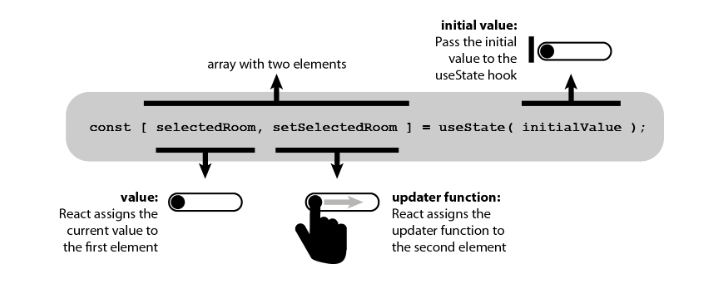
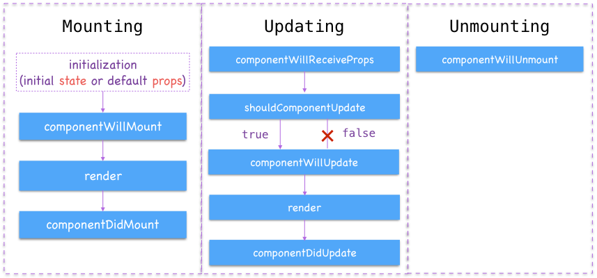

# REACT JS LANJUTAN
## React JS Hooks
Hooks merupakan sebuah fitur yang baru dikenalkan di React JS pada tahun 2018. Hooks berguna untuk memudahkan penggunaan functional components agar bisa menggunakan state dan lifecycle lainnya. Hooks yang sering digunakan adalah `useState` dan `useEffect`. Kedua hal ini sama dengan state dan lifecycle di class yang biasa kita gunakan.

### Perbedaan Functional Component dengan Class Component
#### Class 
    class component extends React.Component {
        constructor(props) {
            super(props);
            this.state = { nama: "Burhan" };
        }

        render() {
            return <h1>Hello {this.state.nama}</h1>;
        }
    }

    // Output:
    // Hello Burhan

#### Functional
    import { useState } from 'react';

    function App() {
        const [nama, setNama] = useState("Burhan");

        return <h1>Hello {nama}</h1>;
    }

    // Output:
    // Hello Burhan

Kedua component di atas menghasilkan hal yang sama, hanya saja Class menggunakan state sedangkan Functional menggunakan state hooks.

Berdasarkan code kedua component di atas, bisa dilihat bahwa penggunaan functional component dengan menggunakan hooks, code terlihat lebih rapi, pendek, dan mudah untuk dimengerti.

### `useState` Syntax Structure

http://www.room51.co.uk/tutorials/react/usestate/part1.html

#### Cara Penggunaan `useState`
    // 1. Import useState dari react
    import { useState } from 'react';

    function App() {
        // 2. Menuliskan useState hooks
        const [nama, setNama] = useState("Burhan");

        // 3. Pemanggilan data
        return <h1>Hello, I am {nama}</h1>;
    }

    // Output:
    // Hello, I am Burhan

### `useEffect` Hooks
`useEffect` merupakan hooks yang bisa digunakan untuk menggunakan lifecycle pada functional component dengan mudah. Lifecycle yang ada di dalam hooks hanya menggunakan `useEffect` yang menyatukan `componentDidMount`, `componentDidUpdate`, dan `componentWillUnmount`.

#### Lifecycle Structure

- Fase **Mounting** adalah fase ketika components dibuat atau pertama kali dirender ke DOM.
- Fase **Updating** adalah fase ketika sebuah component akan dirender ulang, biasanya ini terjadi ketika ada perubahan pada state atau props yang mengakibatkan perubahan DOM.
- Fase **Unmounting** adalah fase ketika component dihapus dari DOM.

#### Cara Penggunaan `useEffect`
    // 1. Import useEffect dari react
    import { useEffect } from 'react';

    // 2. Tuliskan penggunaan useEffect sebelum render
    ...
        useEffect(() => {
            console.log(" ");
        }, [ ])
    ...

Hooks harus selalu dipanggil di bagian atas component, yaitu biasanya setelah pembuatan function component, begitu juga untuk `useState` dan `useEffect`. Kemudian gunakan `[]` di akhir `useEffect` agar tidak terjadi re-render yang berlebihan.

## PropTypes
PropTypes merupakan sebuah **lib** yang dapat membantu untuk memeriksa data props yang dikirim agar sesuai denga ekspektasi. Jika tidak sesuai, maka akan muncul pesan error.

#### Install PropTypes
    npm install prop-types

# REACT ROUTER 6
Routing adalah proses di mana pengguna diarahkan ke halaman yang berbeda berdasarkan tindakan atau permintaan mereka. React Router digunakan untuk menentukan beberapa rute dalam aplikasi. React Router merupakan sistem perpustakaan standar yang dibangun di atas React dan digunakan untuk membuat perutean di aplikasi React menggunakan Paket React Router.

React Router memainkan peran penting untuk menampilkan banyak tampilan dalam satu aplikasi halaman. Tanpa React Router, tidak mungkin menampilkan banyak tampilan di aplikasi React. Sebagian besar situs media sosial seperti Facebook, Instagram menggunakan React Router untuk menampilkan banyak tampilan.

### Instalasi React Router
    npm install react-router
    nmp install react-router-dom

Ada dua jenis komponen router:
- `<BrowserRouter>`, digunakan untuk menangani URL dinamis.
- `<HashRouter>`, digunakan untuk menangani permintaan statis.

#### Route
Route digunakan untuk mendefinisikan dan merender komponen berdasarkan jalur yang ditentukan. Ini akan menerima komponen dan membuat untuk menentukan apa yang harus dirender.

#### Link
Komponen `<Link>` digunakan untuk membuat tautan yang memungkinkan untuk menavigasi pada URL yang berbeda dan membuat kontennya tanpa memuat ulang halaman web.

#### Link vs NavLink
Komponen `<Link>` memungkinkan navigasi berbagai rute di situs web, sedangkan komponen `<NavLink>` digunakan untuk menambahkan gaya ke rute aktif.

#### Switch
Komponen `<Switch>` digunakan untuk merender komponen hanya ketika jalur akan cocok. Jika tidak, maka kembali ke komponen yang tidak ditemukan.

#### Redirect
Komponen <Redirect> digunakan untuk mengarahkan ke rute lain dalam aplikasi kita untuk mempertahankan URL lama.

# STATE MANAGEMENT REDUX
## React Redux
Redux adalah sebuah state management. State management adalah cara untuk memfasilitasi komunikasi dan berbagai data lintas komponen. State management menciptakan struktur data yang nyata untuk mewakili keadaan aplikasi kita yang dapat digunakan untuk membaca dan menulis. Dengan begitu, kita dapat melihat keadaan sebaliknya yang tidak terlihat saat kita mengerjakannya.

### Komponen Redux dan Cara Kerjanya
1. Action

    Action merupakan objek JavaScript biasa dan harus memiliki tipe properti (property type) untuk menunjukan jenis action yang akan dilakukan. Selain itu, Action harus memiliki muatan yang berisi informasi yang harus dikerjakan oleh action tersebut.
2. Reducer

    Reducer adalah fungsi murni yang mengambil status aplikasi saat ini. Reducer juga berfungsi untuk melakukan tindakan,dan mengembalikan status baru (new state). Status ini disimpan sebagai objek, dan menentukan bagaimana status aplikasi berubah sebagai respons terhadap tindakan yang dikirim ke store.
3. Store

    Store berfungsi untuk menyimpan status aplikasi. Sangat disarankan untuk hanya menyimpan satu store di aplikasi Redux apa pun. Anda dapat mengakses status yang disimpan, mengupdate status, dan mendaftarkan atau membatalkan pendaftaran listener melalui metode helper.

#### Set Up Redux
    npm install redux react-redux

## Redux Thunk
Redux Thunk adalah sebuah  middleware yang memungkinkan kita untuk menulis Action yang mengembalikan function, bukan action.

### Cara Kerja Redux Thunk
#### Code yang tidak menggunakan Redux Thunk
    let add = 1 + 2;
    
    console.log(add);

#### Code yang menggunakan Redux Thunk
    function add(num1, num2) {
        return num1 + num2;
    }

    console.log(addFunc(2,7))

Kesimpulannya jika kita menggunakan Redux Thunk maka kita dapat mengembalikan nilai-nya menjadi function bukan hanya sebagai result.